# Catálogo Maestro ESP de stemOS LXP (English for Specific Purposes)

> **Documento Oficial de Arquitectura Curricular & Especificación de Contenidos**  
> **Versión:** 2.1.0 — Septiembre 2026  
> **Alineación:** Nearshoring Industrial México-EE.UU. / Estándares SEP CONOCER / Acreditaciones Internacionales (IEEE, ICAO, NATO STANAG, ISO, FDA, AWS).

---

## 1. Visión y Estructura del Catálogo

El catálogo de **Inglés para Fines Específicos (ESP)** de **stemOS** está diseñado para cerrar la brecha de comunicación técnica entre el talento de ingeniería en América Latina y los centros de toma de decisiones corporativas en Estados Unidos y mercados globales.

El catálogo se organiza en **4 Categorías Maestras** con **26 Tracks de Aprendizaje Modular**, eliminando la fragmentación y manteniendo una identidad STEM de alto rigor:

```mermaid
graph TD
    A[stemOS ESP Master Catalog] --> B[TECHNOLOGY<br>6 Tracks]
    A --> C[ENGINEERING & INDUSTRY<br>8 Tracks]
    A --> D[SCIENCE & FUTURE TECH<br>6 Tracks]
    A --> E[AVIATION, CAREER & PRO<br>6 Tracks]

    B --> B1[Smart Networks & Cybersecurity]
    B --> B2[Information Technology & Digital Innovation]
    B --> B3[AI & Machine Learning ]
    B --> B4[Telecommunications & IoT]
    B --> B5[Software Development & Programming]
    B --> B6[Data Science & Analytics ]

    C --> C1[Semiconductor Manufacturing]
    C --> C2[Electromobility & EV Engineering]
    C --> C3[Aerospace Manufacturing]
    C --> C4[Robotics & Automation ]
    C --> C5[Energy & Renewable Technologies ]
    C --> C6[Engineering & Advanced Manufacturing]
    C --> C7[Industrial Engineering & Operations]
    C --> C8[Mechanical Engineering & Mechatronics]

    D --> D1[Biotechnology & Life Sciences]
    D --> D2[Space & Satellite Technology]
    D --> D3[Environmental & Sustainability]
    D --> D4[Healthcare Technology]
    D --> D5[Materials Science & Nanotechnology]
    D --> D6[Food Science & Technology]

    E --> E1[Aviation English ]
    E --> E2[Air Force Aerospace English ]
    E --> E3[Hospitality & Food Service English]
    E --> E4[Business, Leadership & Management English]
    E --> E5[Project Management & Professional Communication]
    E --> E6[Entrepreneurship & Innovation English]
```



---

## 2. Ruta de Progresión Estratégica: Fase 2

Para maximizar el impacto formativo y mantener la identidad tecnológica de **stemOS**, la expansión prioritaria se estructura en una secuencia continua de valor industrial:

$$\text{Technology} \longrightarrow \text{Engineering} \longrightarrow \text{Aerospace} \longrightarrow \text{Data / AI} \longrightarrow \text{Career}$$

```
[Fase Actual: 5 Tracks Base]
  Smart Networks & Cyber • Semiconductors • Electromobility • IT & Cloud • Aerospace Mfg
       │
       ▼
[Fase 2: Expansión Prioritaria]
  1. AI & Machine Learning (aiml) ──────────────► Inferencia NPU, Redes Neuronales, Transformers
  2. Robotics & Automation (robot) ─────────────► Cinemática 6-DoF, PLCs IEC 61131, Cobots ISO 10218
  3. Aviation English (aveng) ──────────────────► Fraseología OACI, Radiotelefonía ATC, Readbacks
  4. Air Force Aerospace English (af) ──────────► Aerodinámica Supersónica, Envolvente de Vuelo, Brevity Codes
  5. Data Science & Analytics (data) ───────────► Streaming Kafka, Lakehouse Parquet/Iceberg, Embeddings
  6. Energy & Renewable Technologies (energy) ──► Solar PV a Gran Escala, Inversores GFM, BESS, Hidrógeno
```

---

## 3. Matriz Curricular Detallada de los 26 Tracks

### CATEGORÍA 1: TECHNOLOGY (6 Tracks)

| Track ID | Nombre en Inglés | Nombre en Español | Estándar / Certificación | Nivel CEFR | Estado |
| :--- | :--- | :--- | :--- | :--- | :--- |
| `cybersecurity` | **Smart Networks & Cybersecurity** | Redes Inteligentes y Ciberseguridad | CompTIA Network+ / CONOCER EC1290 | A2-B1 | **Full (9 lecturas)** |
| `it-innovation` | **IT & Digital Innovation** | TI & Innovación Digital | AWS Cloud Practitioner / ISO 27001 | A2-B1 | **Full (10 lecturas)** |
| `ai-ml` | **AI & Machine Learning** | IA y Aprendizaje Automático | NVIDIA Generative AI / IEEE 7000 | A2-B1 | **Full (Fase 2)** |
| `telecom-iot` | **Telecommunications & IoT** | Telecomunicaciones e IoT | 3GPP 5G NR / LoRaWAN Standard | A2-B1 | Blueprint (5 módulos) |
| `software-dev` | **Software Development & Programming** | Desarrollo de Software | ISO/IEC 25010 Clean Code / Scrum | A2-B1 | Blueprint (5 módulos) |
| `data-analytics` | **Data Science & Analytics** | Ciencia de Datos y Analítica | Databricks Data Engineer / ISO 20547 | A2-B1 | **Full (Fase 2)** |

### CATEGORÍA 2: ENGINEERING & INDUSTRY (8 Tracks)

| Track ID | Nombre en Inglés | Nombre en Español | Estándar / Certificación | Nivel CEFR | Estado |
| :--- | :--- | :--- | :--- | :--- | :--- |
| `semiconductors` | **Semiconductor Manufacturing** | Fabricación de Semiconductores | SEMI Standards / CONOCER EC1338 | A2-B1 | **Full (12 lecturas)** |
| `electromobility` | **Electromobility & EV Engineering** | Electromovilidad y Vehículos Eléctricos | SAE J1772 / ISO 26262 / UN ECE R100 | A2-B1 | **Full (12 lecturas)** |
| `aerospace` | **Aerospace Manufacturing** | Manufactura Aeronáutica | AS9100D / NADCAP / FAA Part 21 | A2-B1 | **Full (9 lecturas)** |
| `robotics-automation` | **Robotics & Automation** | Robótica Industrial y Automatización | ISO 10218 / RIA R15.06 / IEC 61131-3 | A2-B1 | **Full (Fase 2)** |
| `energy-renewables` | **Energy & Renewable Technologies** | Energías Renovables y Tecnologías Limpias | IEEE 1547 / IEC 61215 PV / IEC 61400 | A2-B1 | **Full (Fase 2)** |
| `advanced-manufacturing` | **Engineering & Advanced Manufacturing** | Ingeniería y Manufactura Avanzada | ASME Y14.5 GD&T / ASTM Additive Mfg | A2-B1 | Blueprint (5 módulos) |
| `industrial-operations` | **Industrial Engineering & Operations** | Ingeniería Industrial y Operaciones | T-MEC Capítulo 5 / Incoterms 2020 / Six Sigma | A2-B1 | **Full (Lectura)** |
| `mechatronics` | **Mechanical Engineering & Mechatronics** | Mecánica y Mecatrónica | ASME BTH-1 / ISO 12100 Seguridad | A2-B1 | Blueprint (5 módulos) |

### CATEGORÍA 3: SCIENCE & FUTURE TECHNOLOGY (6 Tracks)

| Track ID | Nombre en Inglés | Nombre en Español | Estándar / Certificación | Nivel CEFR | Estado |
| :--- | :--- | :--- | :--- | :--- | :--- |
| `biotechnology` | **Biotechnology & Life Sciences** | Biotecnología y Ciencias de la Vida | cGMP / FDA 21 CFR Part 211 / ISO 14644 | A2-B1 | Blueprint (5 módulos) |
| `space-satellite` | **Space & Satellite Technology** | Tecnología Espacial y Satelital | NASA-STD / CubeSat Design Spec | A2-B1 | Blueprint (5 módulos) |
| `environmental-sustainability` | **Environmental & Sustainability** | Sustentabilidad y Tecnología Ambiental | ISO 14001 / GHG Protocol / ESG Scope 1-3 | A2-B1 | Blueprint (5 módulos) |
| `healthcare-tech` | **Healthcare Technology** | Tecnología en Salud y Biomédica | FDA 21 CFR Part 820 / ISO 13485 | A2-B1 | **Full (Lectura)** |
| `materials-nanotech` | **Materials Science & Nanotechnology** | Ciencia de Materiales y Nanotecnología | ASTM International Advanced Materials | A2-B1 | Blueprint (5 módulos) |
| `food-science` | **Food Science & Technology** | Ciencia de los Alimentos y Agroindustria | FDA FSMA / HACCP / ISO 22000 | A2-B1 | **Full (Lectura)** |

### CATEGORÍA 4: AVIATION, CAREER & PROFESSIONAL ENGLISH (6 Tracks)

| Track ID | Nombre en Inglés | Nombre en Español | Estándar / Certificación | Nivel CEFR | Estado |
| :--- | :--- | :--- | :--- | :--- | :--- |
| `aviation-english` | **Aviation English** | Inglés Aeronáutico y Radiotelefonía | OACI Anexo 1 (Nivel 4-6) / FAA AC 60-28 | A2-B1 | **Full (Fase 2)** |
| `airforce-aerospace` | **Air Force Aerospace English** | Inglés Aeroespacial Militar y Defensa | OTAN STANAG 6001 / MIL-STD-1553 | A2-B1 | **Full (Fase 2)** |
| `hospitality-food` | **Hospitality & Food Service English** | Inglés para Hotelería y Servicios | Forbes Travel Guide 5-Star / AHLA | A2-B1 | **Full (Lectura)** |
| `business-leadership` | **Business, Leadership & Management English** | Inglés para Negocios y Liderazgo | ISO 30414 / T-MEC Anexo 31-A Laboral | A2-B1 | **Full (Lectura)** |
| `project-management` | **Project Management & Communication** | Gestión de Proyectos y Comunicación | PMI PMBOK 7ma Edición / Agile Scrum | A2-B1 | Blueprint (5 módulos) |
| `entrepreneurship` | **Entrepreneurship & Innovation English** | Emprendimiento e Innovación Tecnológica | Silicon Valley VC Due Diligence / Lean Startup | A2-B1 | Blueprint (5 módulos) |

---

## 4. Adaptación Pedagógica Dual CEFR (A2 / B1)

Cada módulo incorpora en su arquitectura de entrega dos capas cognitivas:

1. **Nivel A2 (Inglés Funcional / Andamiaje Latinoamericano):**
   - Estructuras sujeto-verbo-objeto directas en presente simple e imperativo técnico.
   - Glosario contextual de cognados transparentes (*connection* $\to$ *conexión*, *device* $\to$ *dispositivo*).
   - Caja de andamiaje gramatical para estudiantes de formación técnica inicial.

2. **Nivel B1/B2 (Inglés Ejecutivo / Auditorías Industriales de Nearshoring):**
   - Oraciones subordinadas complejas y voz pasiva reglamentaria para reportes de no conformidad (NCR) y acciones correctivas (CAPA).
   - Condicionales de respuesta ante incidentes (*"If the link latency exceeds 50ms, then automated failover protocols MUST trigger instantly"*).
   - Terminología de auditoría internacional y presentación ante directores de ingeniería en EE.UU.

---

## 5. Implementación en el Código Fuente

- **Base de Datos Maestra:** [content/courses.js](file:///Users/yepz/stemOS/content/courses.js)
- **Controlador de UI y Filtros:** [dev.js](file:///Users/yepz/stemOS/dev.js) y [dev/index.js](file:///Users/yepz/stemOS/dev/index.js)
- **Estilos Visuales:** [dev.css](file:///Users/yepz/stemOS/dev.css)
- **Explorador Interactivo:** Accesible en local y producción en `/dev` o `/dev.html`.
